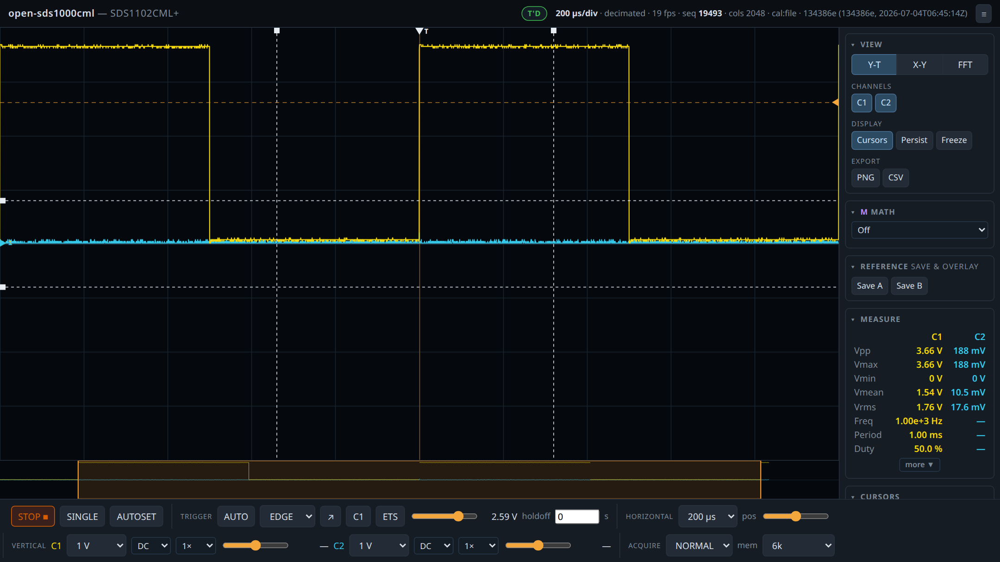
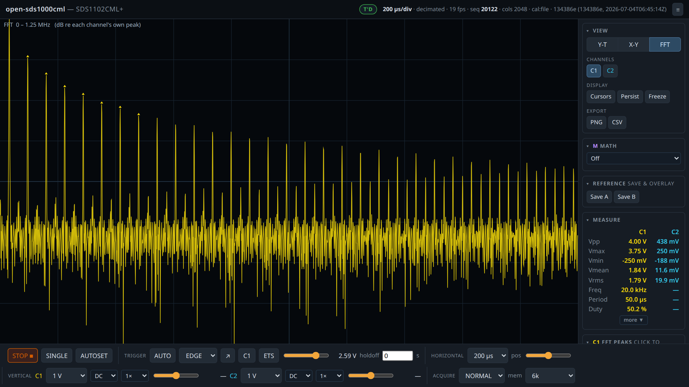
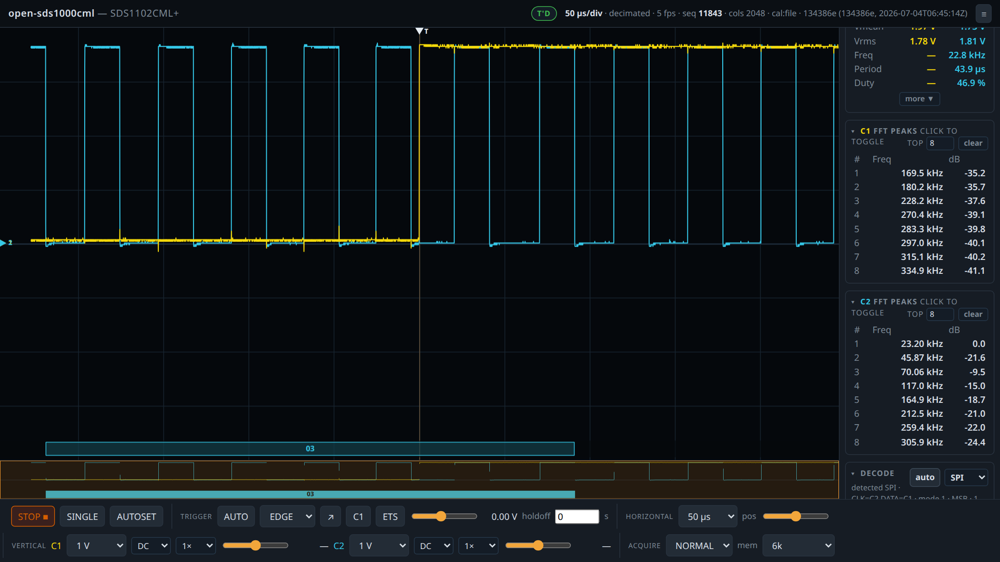
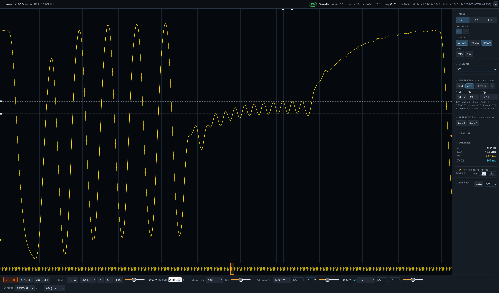
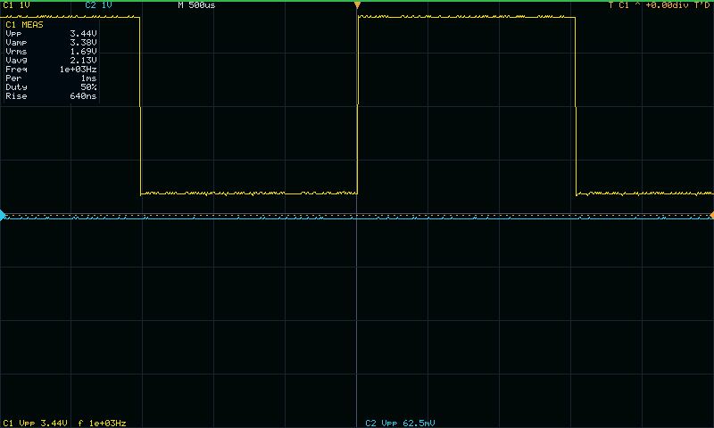
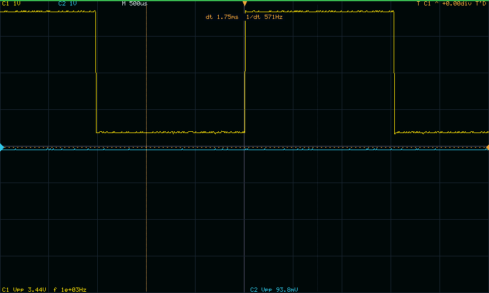
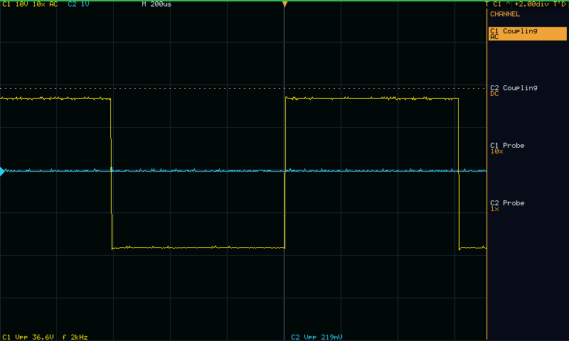

# open-sds1000cml

Clean-room replacement firmware for the **Siglent SDS1000CML+** series 2-channel
digital storage oscilloscope (developed and validated on the **SDS1102CML+**).

It replaces the vendor scope application with an open, from-scratch implementation
that drives the instrument's real hardware — acquisition engine, 1 ns–50 s/div
timebase, triggering, vertical analog front end, LCD, and front panel — to
oscilloscope-grade behaviour, and adds a live **web UI** and a **SCPI/VXI-11**
host interface on top.

Everything here was written clean-room from behavioural specifications
([`specs/`](specs/)) — no vendor firmware code. The specs describe *what the
hardware does and how the firmware must behave*; the implementation in
[`app/`](app/) is built from them and validated on a real unit.

> ⚠️ **Safety / use at your own risk.** This is experimental firmware that takes
> over a mains-powered instrument and drives its real relays, gain/offset DACs and
> memory-mapped acquisition bus. A bug can wedge the acquisition engine or leave the
> front end in an unexpected state. Recovery is normally automatic (the on-device
> supervisor relaunches the app) or a takeover-revert; the last resort is a mains
> power-cycle. It is written for the **SDS1000CML+ series only** — do not run it on
> other hardware. There is **no warranty** (see [LICENSE](LICENSE)); you are
> responsible for your instrument.


<sub>The web UI (Y-T mode, cursors on, live auto-measurements) driving a real SDS1102CML+.</sub>

## Highlights

- **Full acquisition engine** — single-owner GPMC design (one goroutine owns the
  inherited `/dev/Gpmc` fd), per-frame arm → capture-halt → drain → re-arm, triple-
  buffered publish, wedge-recovery ladder.
- **33-detent timebase** 1 ns – 50 s/div: native-fast, decimated, slow-envelope,
  roll, and opt-in equivalent-time sampling (ETS).
- **Triggering** — EDGE with software slope validation, plus PULSE / SLOPE / VIDEO
  qualifiers, and **trigger holdoff**.
- **Acquisition modes** — NORMAL, AVERAGE, ERES, PEAK.
- **Vertical front end** — 12-detent V/div ladder (SPI relay + gain DAC),
  calibrated offset DAC, **probe attenuation (×1/×10/×100)**, and
  **AC / DC / GND coupling** (software-modelled — see the design note below).
- **Measurements** — a shared measurement core (`internal/measure`) computes
  Vpp/Vmax/Vmin/Vmean/Vrms, histogram Vtop/Vbase/Vamplitude, and timing
  (frequency, period, duty, 10–90 % rise/fall, ± pulse width, over/preshoot),
  identical on the web UI and the device LCD.
- **Web UI** (`http://<device>:8080/`) — responsive canvas display over a **binary
  frame transport that keeps the browser at engine frame-rate** even on deep
  captures, Y-T / X-Y / FFT (per-channel) with **rubber-band box-zoom in time *and*
  voltage** and a **zoomable FFT with clickable peak measurements and a live
  dB/frequency pointer readout**, auto-measurements, draggable time/voltage cursors,
  waveform persistence, math (C1±C2, C1×C2, FFT-carrier subtraction), **reference
  waveforms (REF A/B)**, autoset, protocol decode (UART/I²C/SPI) with auto-detect,
  a clipping indicator, and PNG / calibrated-CSV export.
- **Super-resolution (stack & crunch)** — for a repetitive waveform, equivalent-time
  stacking (sub-sample alignment → lucky-frame selection → drizzle onto a fine grid)
  recovers resolution below the 8-bit ADC: measured **~5 extra bits (≈13-bit
  effective)** on a repetitive signal. It's a first-class view — toggle it, run it on
  either channel, and do FFT / measurements / X-Y on the stacked result. (Diminishing
  returns near Nyquist, where alignment jitter — not noise — is the limit.)
- **On-device UI** — LCD renderer with a softkey menu system, a calibrated
  **on-screen MEASURE panel**, **on-screen cursors**, and per-channel
  coupling/probe pages driven from the front panel.
- **Host interface** — SCPI over VXI-11 (ONC-RPC): `*IDN?`, timebase / vertical /
  trigger control, byte-exact `Cn:WF?` waveform transfers, `SCDP` screenshot.
- **Over-the-air ops** — an on-device supervisor with A/B slots + health rollback,
  and a host controller (`otactl`) for status, file transfer, updates, factory
  takeover/revert, and (optional) Shelly mains-power control.

### Design note: coupling on this clone

On this hardware, AC coupling has no effective hardware high-pass and the GND relay
bit alone does not reliably ground the input (it needs a factory-firmware config-plane
write that is unsafe to reproduce; re-emitting the relay word from the boot state can
also collapse the other channel's gain). This firmware therefore models coupling
**in software** — AC removes the DC component, GND shows a flat ground trace, DC
passes through — which is safe, always works, and matches on both the web and the LCD.
See [`specs/06-vertical-and-analog.md`](specs/06-vertical-and-analog.md) §6.

## The host UI (web app)

Served at `http://<device>:8080/` — a responsive, single-page control surface for
the whole instrument. Y-T with direct-manipulation cursors and live measurements
(the [screenshot above](docs/images/host-yt.png)), an X-Y mode, a per-channel FFT
with clickable peak markers, waveform math and reference overlays, and one-click
protocol decode with auto-detection.

| Per-channel FFT | Protocol decode (auto-detected) |
|---|---|
| [](docs/images/host-fft.png) | [](docs/images/host-decode.png) |
| Spectra of a 20 kHz square — its odd-harmonic comb, with the strongest peaks tagged. | UART/I²C/SPI decode; here it auto-detected SPI (CLK=C2, DATA=C1), with per-channel FFT peak lists alongside. |

Every acquisition control lives in the footer (run/stop, trigger, timebase,
per-channel V/div · coupling · probe · offset, acquire mode + memory depth), and
PNG / calibrated-CSV export is one click away.

### Super-resolution: stack & crunch

For a repetitive waveform the UI can stack many captures in equivalent time —
aligning each to sub-sample precision, keeping only the "lucky" best-aligned frames,
and drizzling them onto a fine grid — to pull resolution out of the 8-bit ADC. Below,
a phase-locked burst (5 cycles of 50 MHz, 15 of 150, 25 of 250 MHz, looping at
3.33 MHz) after ~1100 stacked frames: **+5.0 bits, ≈13-bit effective**, on a
32 GSa/s equivalent-time grid.

[](docs/images/host-superres.png)
<sub>Stack & crunch on a 50/150/250 MHz burst — the big 50 MHz cycles at full
amplitude next to the tiny 150 MHz ripple (cursors: 153 MHz) rolled off by the analog
bandwidth, all reconstructed from an 8-bit front end. The gain is largest at low/mid
frequencies and tapers near Nyquist, where alignment jitter dominates.</sub>

A **resample-kernel** selector trades noise floor against near-Nyquist fidelity:
*interp* (default) resamples every frame at every fine bin — lowest noise floor and
a measurable ENOB, but it softens content near the raw Nyquist; *drizzle* deposits
each real sample at its aligned sub-sample position — on the burst it preserves the
250 MHz tone ~9 dB better (and reconstructs it more faithfully), at a higher noise
floor. On a fine grid the deposit bins are too sparse for a time-domain σ, so read
each tone's improvement from the per-peak **FFT SNR** readout instead.

## On the instrument (LCD + front panel)

The firmware isn't only a web front end — it drives the scope's own 800×480 LCD and
front-panel matrix, so it's a self-contained instrument. Front-panel softkeys drive
a menu system, a calibrated on-screen MEASURE panel and on-screen cursors (both from
the *same* measurement core as the web UI), and per-channel coupling/probe pages.

| On-screen MEASURE panel | On-screen cursors | Front-panel menu |
|---|---|---|
| [](docs/images/lcd-measure.png) | [](docs/images/lcd-cursors.png) | [](docs/images/lcd-menu.png) |
| Calibrated Vpp/Vamp/Vrms/Vavg + timing, matching the web. | Time cursors with a live Δt / 1÷Δt readout. | The CHANNEL softkey page — coupling + probe per channel, with the "10×"/"AC" HUD tags. |

## Install from a release (no build — Windows / macOS / Linux)

The easiest path: grab the ready-to-run USB image from
[**Releases**](../../releases) and drop it on a USB stick. The stock firmware
runs `startup.sh` from the stick at boot, and the agent takes over and launches
the scope app — no firmware modification.

**1. Download** `open-sds1000cml-<version>-usb.zip` from the latest release.
Optionally verify it against `SHA256SUMS` from the same release:
`sha256sum -c SHA256SUMS` (Linux) · `shasum -a 256 -c SHA256SUMS` (macOS) ·
`CertUtil -hashfile open-sds1000cml-*-usb.zip SHA256` (Windows).

**2. Format a USB stick as MBR + FAT32** (any small stick; this erases it — a
**GPT** stick will *not* boot):

- **Windows** — [Rufus](https://rufus.ie): select the stick → *Boot selection:*
  **Non bootable** → *Partition scheme:* **MBR** → *File system:* **FAT32** →
  **Start**. (Windows' own diskpart/Format can't make FAT32 above **32 GB**; use
  Rufus, or a stick ≤32 GB.)
- **macOS** — Disk Utility → *View ▸ Show All Devices* → pick the USB **device**
  (the top-level entry, not the volume underneath) → **Erase** → *Format:*
  **MS-DOS (FAT)**, *Scheme:* **Master Boot Record** → **Erase**. Give it a simple
  one-word name (no spaces).
- **Linux** — GParted (install via your package manager if needed): pick the
  stick in the **top-right device dropdown** (double-check the size — the wrong
  device erases your system) → *Device ▸ Create Partition Table ▸* **msdos** →
  one **fat32** partition.

**3. Extract the zip so its contents land on the stick's ROOT** — afterwards the
top level of the stick must be `startup.sh`, `commands`, `ota/`, `agent-slots/`
(and `LICENSE.txt`, `SAFETY.txt`), **not** inside a subfolder:

- **Windows** — right-click the zip → *Extract All…*. The wizard pre-fills a
  destination folder **named after the zip** — **clear it so the path is exactly
  the drive letter (e.g. `E:\`)**, then Extract. (Easiest foolproof way: open the
  zip and **drag the items onto the drive** — that never nests.) Then open the
  drive and confirm `startup.sh` is right there at the root. If everything is
  inside an `open-sds1000cml-…` folder, move it up to the root.
- **macOS** — find the mount name (it's under `/Volumes/`), then
  `unzip ~/Downloads/open-sds1000cml-*-usb.zip -d /Volumes/YOUR_USB`. (Finder may
  scatter harmless `.DS_Store`/`._*` files on the stick — ignore them.)
- **Linux** — find the mount with `lsblk`; it's usually `/media/$USER/YOUR_USB`
  (Ubuntu/Debian) or `/run/media/$USER/YOUR_USB` (Fedora), then
  `unzip open-sds1000cml-*-usb.zip -d <that path>`.

**4. Safely eject the stick, plug it into the scope, and reboot the scope**
(power-cycle). *Wait for the eject to finish* so the files fully flush — macOS
`diskutil eject /Volumes/YOUR_USB`, Linux `sync && udisksctl unmount -b /dev/sdX1`,
Windows *Safely Remove Hardware*. Within a couple of seconds of boot it takes over
the instrument and serves the UI.

**5. Open** `http://<scope-ip>:8080/` in a browser. Find the scope's IP in your
**router's DHCP / connected-devices list** (once it takes over, the vendor network
menu is gone, and the clean-room LCD doesn't show the IP).

**Manage / update from your computer (optional):** download the matching
`otactl-<os>-<arch>` from the same release. First run needs a nudge on each OS —
macOS: `chmod +x otactl-darwin-arm64 && xattr -d com.apple.quarantine otactl-darwin-arm64`;
Linux: `chmod +x otactl-linux-amd64`; Windows: on the SmartScreen prompt click
*More info ▸ Run anyway*. Then e.g. `otactl -tcp <ip>:5900 status`. To update the
app later, copy a new `app` binary off the stick's `agent-slots/A/app` (or build
one) and `otactl -tcp <ip>:5900 -stage /usr/bin/siglent/usr/media/U-disk0/agent-slots/staging update-app <app>`.

> ⚠️ Same safety notes as above — experimental firmware, SDS1000CML+ series only,
> no warranty. It will take over **whatever** SDS1000CML+ you boot it in. To try
> it *without* taking over, edit `ota/agent.env` on the stick and set
> `OTA_AUTO_TAKEOVER=0` (coexist mode — remote access only).

## Build from source

Requires Go (see [`app/go.mod`](app/go.mod)) and an **MBR-partitioned, FAT32 USB
stick** — the stock firmware runs `startup.sh` from it at boot, which is how the
agent gets in and takes over (no firmware modification). See [`ota/`](ota/) for
the full model.

```sh
# On your computer, make a ready-to-run USB boot stick (MBR + FAT32). This builds
# the agent AND the clean-room app, pre-loads the app into the boot slots, and
# defaults auto-takeover ON — so the stick boots straight into the working scope:
sudo ota/mkstick.sh --format /dev/sdX      # DESTRUCTIVE, heavily guarded
#   (or, onto an already-mounted FAT32 stick:  ota/mkstick.sh <mountpoint>)

# Move the stick to the scope and REBOOT it (the firmware runs startup.sh from the
# stick only at boot). Then, back on your computer, confirm it came up:
ota/checkdev.sh <device-ip>                # -> http://<device>:8080/
```

To push a newer app later (over the network, no reboot):

```sh
cd app && make app && make test            # build + full offline test suite
../ota/dist/otactl -tcp <device>:5900 \
  -stage /usr/bin/siglent/usr/media/U-disk0/agent-slots/staging \
  update-app dist/app-arm                  # upload -> inactive slot -> restart, health-rollback on failure
```

Recovery: `otactl untakeover` restores the factory app; the last resort is a mains
power-cycle. See [`ota/README.md`](ota/README.md) for the full supervisor/OTA model.

## Layout

| Path | What |
|---|---|
| [`app/`](app/) | The clean-room scope application (Go, ARMv7). Engine, front end, LCD, panel, web UI, SCPI. |
| [`ota/`](ota/) | On-device supervisor (`agent`), host controller (`otactl`), and the USB boot anchor. |
| [`specs/`](specs/) | The behavioural specifications the firmware is built from. Start with `specs/README.md`. |

## Contributing

Contributions are welcome — see [CONTRIBUTING.md](CONTRIBUTING.md). In short: keep
changes validated (the offline `make test` suite plus, where relevant, the web
end-to-end harness), match the surrounding code, and don't break the load-bearing
architecture rules (single GPMC owner, inherit-don't-open, absolute front-end writes).

## License

[MIT](LICENSE).
