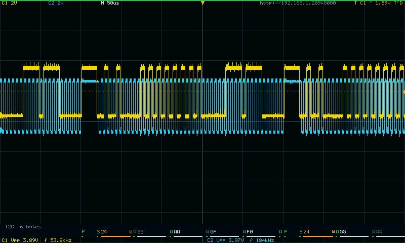
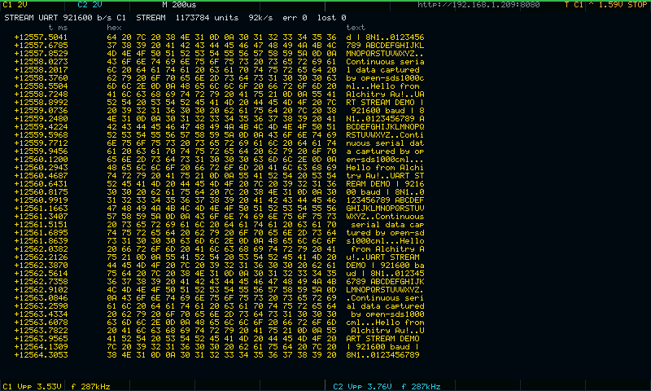
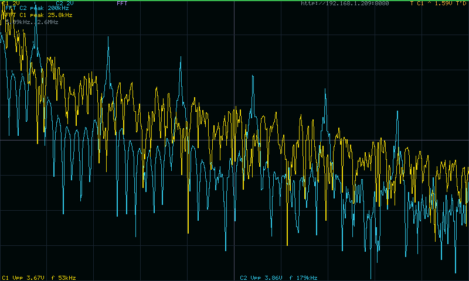
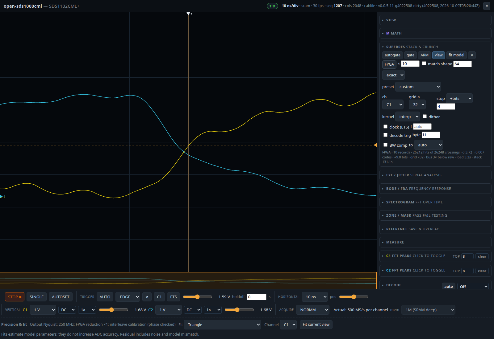
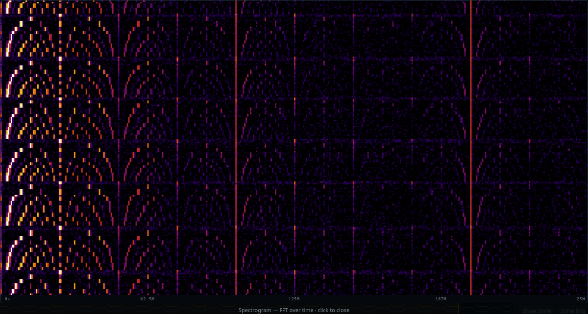
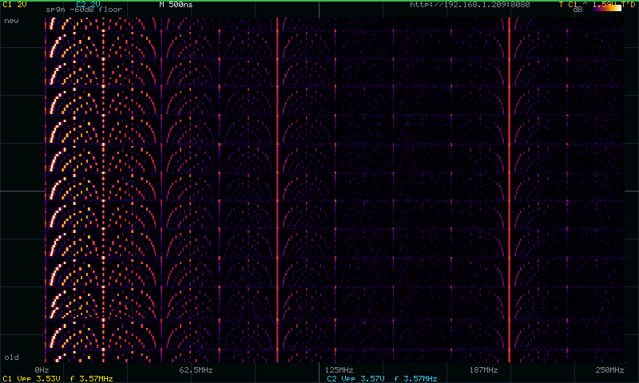

# open-sds1000cml

Open replacement firmware for the **Siglent SDS1000CML+** two-channel oscilloscope (developed on the
SDS1102CML+). It turns a budget 100 MHz scope into a deep-memory protocol and analysis instrument:
both channels at 500 MS/s into a 1 M-sample record, hardware triggers on ten serial protocols,
continuous decoding, super-resolution and a full web interface. It replaces the application on the
scope's ARM processor and the FPGA images that application loads. Nothing is flashed: a power cycle
always brings back the factory firmware.

> ⚠️ **Use at your own risk.** This firmware takes over a mains-powered
> instrument and drives its relays, DACs and acquisition bus. It is for the
> SDS1000CML+ series only. There is no warranty (see [LICENSE](LICENSE) and
> [SAFETY.txt](SAFETY.txt)).

## In action



**Trigger on the data, directly on the scope.** The FPGA matches the I²C byte
sequence `55 AA` in a write to address `0x24`, keeping the decoded transaction
near the center. SDA is C1 (yellow), SCL is C2 (cyan); the address and payload
`55 AA 0F F0` appear below the traces.

| On the scope: continuous UART decoding | On the scope: FFT |
|---|---|
|  |  |

**Long UART streams, directly on the scope.** The AU transmits a repeating
155-byte text message at 921,600 baud (8N1). The LCD capture shows more than
1.1 million received bytes, with timestamps, hex and ASCII text, and zero
reported errors or loss. Alongside it, the FFT view shows frequency-domain
analysis on the same native 800 × 480 display.



**Stack repeated edges.** Complementary 10 MHz signals from the AU, accumulated
in the scope's FPGA: 10 records, 26,212 aligned hits and a ×32 time grid. The
browser shows both reconstructed edges alongside the completed stack's statistics.

| Browser spectrogram | Native LCD spectrogram |
|---|---|
|  |  |

**Watch frequency change over time.** An Alchitry Au steps a real clock from
2.5 MHz to 25 MHz; the waterfall reveals each step and its harmonics.

<sub>Captured from a live SDS1102CML+ running replacement firmware. Browser
captures use a wider sidebar for readability; LCD images are native screen
exports. All waveforms and readouts are from the connected signal.</sub>

## At a glance

| | |
|---|---|
| **Channels** | 2, sampled together |
| **Sample rate** | **500 MS/s per channel**, real time, on both channels at once (1 GS/s aggregate) |
| **Record length** | **1,048,576 samples per channel** at full rate, captured on every acquisition; the full record is read on STOP or SINGLE |
| **Live display** | **16–24 frames/s** from 1 µs/div to 1 ms/div, protocol decode included (about 12 at 5 ms/div) |
| **Precision mode** | 16-bit filtered samples, 524,288 per channel; decimation ×16 to ×1,048,576 for long records (137 s at 50 s/div) |
| **Super-resolution** | up to a **×64 time grid** (31.25 ps); about **+4 bits** from FPGA stacking |
| **Timebase** | 1 ns/div to 50 s/div |
| **Vertical** | 2 mV/div to 10 V/div; DC, AC or GND; 20 MHz bandwidth limit; probe ×1, ×10 or ×100 |
| **Serial protocols** | **10**, each with hardware trigger and decode: UART, I²C, SPI, CAN / CAN FD, FlexRay, ARINC 429, MIL-STD-1553, SENT, Manchester, USB low-speed |
| **Streaming decode** | **continuous, gap-free protocol decoding**, not one capture at a time: 921,600-baud UART ran for 3 minutes without losing a byte, with the full-rate record kept for every frame |
| **Analysis** | 18 automatic measurements, cursors, math, FFT, spectrogram, eye diagram and jitter, mask test |
| **Interfaces** | web UI in any browser, SCPI over VXI-11 (LAN), the scope's own LCD and front panel |

## Acquisition

* **Full-depth capture on both channels.** Every acquisition fills the scope's 2 MiB SRAM: 1 M
  samples per channel at 500 MS/s, 2.1 ms. While running, only a display-sized view of it is read,
  so the screen keeps up; **STOP or SINGLE reads the full record** (about 2 s, with a loading
  indicator), which can then be zoomed, measured, decoded and exported at full resolution.
  Changing V/div, offset or timebase on a stopped record redraws it from memory.
* **Calibrated five-way interleaving.** Each channel runs five 100 MS/s converters in turn. Per-core
  correction removes the interleave pattern (the comb drops from 11 codes to 0.15).
* **Precision mode.** At slow timebases the FPGA decimates by a power of two, ×16 to ×1,048,576,
  through a CIC filter. The ARM applies a 63-tap compensation filter and keeps 16-bit samples, so a
  slow record gains resolution instead of aliasing. The UI shows the resulting bandwidth and bit
  gain.
* **Modes:** normal, average (up to 256 frames), enhanced resolution and precision.
* **Live min/max envelope:** the FPGA reduces the screen to 4,096 min/max points, so narrow events
  stay visible at any zoom. The points are put back in time order, so protocol decode, masks and
  qualified triggers run on live frames too. Average, ERES and precision use a decimated live
  capture instead (their filtering needs true samples); eye diagram and super-resolution read raw
  samples while in use.
* **Responsive controls:** front-panel keys and lamps answer within tens of milliseconds, even
  during a long readout; a LOADING indicator (LCD and web) shows while a record is being read.

## Faster FPGA readout

Compared with CPU readout from the factory FPGA, our DMA path demonstrated
**roughly 3× higher raw transfer throughput** in earlier benchmarks
(11.1 MB/s versus 3.1–3.9 MB/s). DMA replaces the vendor's per-word CPU read loop;
the current driver still polls for completion.

For live viewing, the FPGA sends an **8 KiB min/max envelope instead of a 2 MiB
raw record—256× less sample data to transfer** (about 10–30 ms instead of about 2 s),
while keeping the full record in SRAM for STOP, SINGLE and detailed review.

## Triggering

* **Edge** in hardware, with sub-sample placement: 0.19 ns peak-to-peak edge wander at 5 ns/div.
* **Pulse width, slope and video** (PAL / NTSC, line select), qualified on the captured record.
* **Auto, normal and single** modes; holdoff up to 10 s; force trigger.
* **Protocol triggers in the FPGA** for all ten protocols. Match a byte, word, address, ID or frame
  pattern, with masks and wildcards.
* **Sequence trigger:** chain up to **32 protocol events**, including **trigger on error**.
* **Zone trigger:** draw boxes on the screen that the waveform must cross or avoid.
* **Mask test:** build a golden mask from live frames with time and voltage tolerances. Count
  failures or stop on the first one, and browse the failure gallery.

## Serial protocols

Every protocol has an FPGA trigger and a decoder. The scope loads the FPGA image a protocol needs
automatically.

| Protocol | FPGA image | Highlights |
|---|---|---|
| UART | general | auto baud from 300 Bd to 3 MBd |
| I²C | general | 7-bit address, direction, data bytes |
| SPI | general | all four modes, both bit orders |
| CAN / CAN FD | packet | Classic CAN CRC check; CAN FD ID/data decode (CRC not checked) |
| FlexRay | packet | header and payload; header CRC |
| ARINC 429 | packet | masked 32-bit word |
| MIL-STD-1553 | packet | 16-bit words; parity |
| SENT | packet | tick-calibrated nibbles; CRC |
| Manchester | line | IEEE 802.3 and Thomas conventions |
| USB low-speed | line | PID and payload bytes |

* **Auto-detect** finds the protocol, channel roles, threshold and settings from a capture.
* **Continuous decoding:** a live decoded stream, with the full-rate record kept for every frame.
  UART at **921,600 baud ran lossless for 3 minutes** (16.6 M bytes). At higher rates a lost event
  is marked, never silently dropped.
* Hex, ASCII and combined views, and a watch buffer with regex search.

## Analysis

* **18 automatic measurements:** Vpp, Vmax, Vmin, Vmean, Vrms, AC rms, Vtop, Vbase, amplitude,
  overshoot, preshoot, frequency, period, duty cycle, rise time, fall time, +width and −width.
* **Cursors** in time and voltage, with Δt, 1/Δt and ΔV.
* **Math:** C1 − C2, C2 − C1, C1 + C2, C1 × C2, and carrier removal using FFT peaks.
* **FFT** with a peak table (up to 64 peaks), and a **spectrogram** waterfall.
* **Eye diagram and jitter:** software clock recovery; TIE rms and peak-to-peak, RJ / DJ split,
  period and cycle-to-cycle jitter, eye height and width; TIE histogram and spectrum.
* **Super-resolution:** stacks repeated edges on a time grid up to ×64 finer than the sample period,
  with interpolating, cubic or drizzle kernels, or triggered on a decoded UART byte. The **FPGA
  stacking image** accumulates the hits in hardware, using the same captured records across
  every tile to avoid acquisition-dependent seams. Phase-coherent equivalent-time folding resolves clocks above the trigger
  comparator's range.
* **Reference waveforms** (two), **persistence**, **XY mode**, **freeze** and **autoset**.

## Connect and control

* **Web UI** on port 8080 in any browser, with WebGL rendering and every feature above.
* **Export:** PNG, CSV, sigrok `.sr` (opens in PulseView, with thresholded logic channels), VCD and
  WAV.
* **SCPI over VXI-11** (LAN): Siglent / LeCroy short-form commands, including `WF?` waveform
  transfer with a WAVEDESC header and `SCDP` screenshots, so existing Siglent scripts and VISA tools
  work.
* **On the scope itself:** the LCD (Y-T, X-Y, FFT and spectrogram views) and the real front-panel
  keys and knobs, with menus for every feature. Settings are kept across restarts.
* **Safe updates:** an on-device agent installs new versions over the network into A/B slots and
  rolls back automatically if a version fails its health check. Nothing is written to the scope's
  flash.

## What it adds over the factory firmware

The factory firmware advertises 1 GSa/s real-time sampling, a 40 k-point normal record (2 M points
maximum), and edge, pulse, video, slope and alternate triggers. It lists no serial protocol
triggering or decoding. This firmware adds:

* the full 1 M-sample record on **both** channels on every acquisition;
* hardware triggering and decoding for **ten serial protocols**, sequence triggers and trigger on
  error;
* **streaming decode**: protocol traffic decoded continuously, without the gaps between captures;
* zone triggering, eye-diagram and jitter analysis, a spectrogram, precision mode and
  super-resolution;
* a complete browser interface, sigrok export, and open source you can extend.

## Documentation

The engineering model is the documentation: requirements, architecture, behaviour and design
decisions are in [`model/`](model/) (start with `requirements.yml` and `decisions.yml`). The
behavioural specifications the implementation was written from are in [`specs/`](specs/).

## Layout

| Path | What it is |
|---|---|
| `app/` | The scope application (Go, ARMv7): acquisition engine, triggers, decoders, LCD, front panel, web UI, SCPI/VXI-11. Embeds the four FPGA images. |
| `fpga/` | The FPGA images (Verilog, Cyclone IV EP4CE10): what is common, what each image adds, the shipping bitstreams and the build. |
| `ota/` | The on-device agent and `otactl`: install, launch, health, A/B slots, USB stick builder. |
| `tools/deploy.sh` | Build the release app and install it on a scope over the network. |
| `model/` | The engineering model (documentation). |
| `specs/` | Behavioural specifications. |

## Build, test, deploy

```sh
make test                      # app and ota test suites
fpga/sim.sh                    # self-checking RTL testbenches (iverilog)
make -C app app-release        # ARMv7 app with the four FPGA images embedded
tools/deploy.sh                # build and install on the scope (DEV=192.168.1.209)
node --experimental-strip-types fpga/build.ts --image=general   # rebuild an FPGA image (Quartus 21.1 Lite)
```
