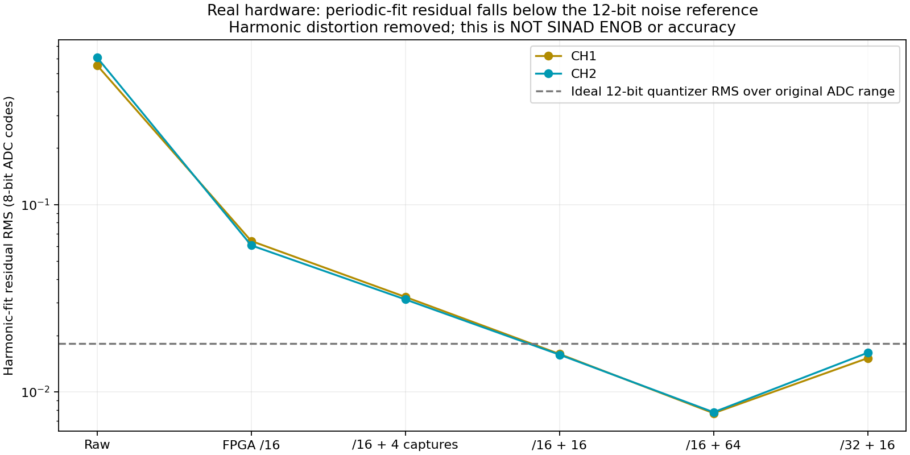
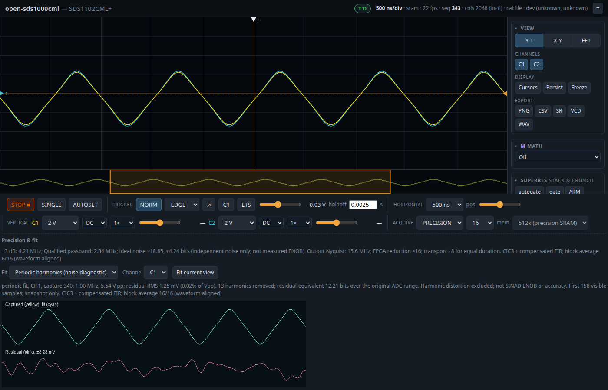

# FPGA precision: hardware E2E, 2026-09-14

Implemented and deployed a selectable PRECISION acquisition mode. The existing revision-11 FPGA reduces the data with CIC3 **before SRAM and the FPGA–ARM interface**. The ARM compensates its response with the existing 63-tap FIR and optionally averages aligned captures. Fractional ADC values remain unsigned 16-bit Q8.8 throughout SRAM recall, ARM processing and the binary web feed. Fitting is an optional web diagnostic; it does not modify acquisition data.

## What the hardware demonstrated

Both connected inputs still carry approximately 1 MHz triangles at 2 V/div (80 mV per original ADC code). Twelve completed acquisitions per case, except six for the 64-average case. A harmonic model removes the periodic signal and harmonic distortion; the remaining RMS is corrected by sqrt(N/(N-parameters)), including the fitted frequency. The conversion is log2(256/(sqrt(12)*RMS_codes)). This is a **residual-equivalent noise metric over the original ADC range**, not SINAD ENOB, linearity, absolute accuracy, or evidence of 12-bit detail in every waveform. Model fitting can exclude deterministic errors; correlated noise makes the simple degrees-of-freedom correction approximate.

| Mode | CH1 / CH2 residual RMS, ADC codes | Residual-equivalent bits CH1 / CH2 | Records |
|---|---:|---:|---:|
| raw | 0.55392 / 0.60905 | 7.06 / 6.92 | 12 |
| r16 | 0.06384 / 0.06050 | 10.18 / 10.25 | 12 |
| r16avg4 | 0.03209 / 0.03111 | 11.17 / 11.21 | 12 |
| r16avg16 | 0.01591 / 0.01578 | 12.18 / 12.19 | 12 |
| r16avg64 | 0.00768 / 0.00777 | 13.23 / 13.21 | 6 |
| r32avg16 | 0.01512 / 0.01615 | 12.26 / 12.16 | 12 |

The /16 modes use 500 ns/div; /32 uses 10 µs/div. Median residual at /16 with 16 captures is approximately 1.27 mV per channel, versus 44–49 mV in the raw comparison. The captured signal occupies only part of the ADC range. The separate browser diagnostic reproduced 12.21 residual-equivalent bits on a completed 16-capture frame in the final deployed build. The 64-average test gave about 13.2 residual-equivalent bits, with a correspondingly slower completed-result rate.

## Bandwidth, transfer and depth

| Timebase | FPGA reduction | Output samples/s/channel | Qualified passband | −3 dB bandwidth (approx.) | Bytes reduction for equal duration | SRAM duration |
|---|---:|---:|---:|---:|---:|---:|
| 500 ns/div | 16 | 31.25 M | 2.344 MHz | 4.206 MHz | 8× | 16.78 ms |
| 10 µs/div | 32 | 15.625 M | 1.172 MHz | 2.103 MHz | 16× | 33.55 ms |
| 100 µs/div | 256 | 1.953125 M | 146.48 kHz | 263 kHz | 128× | 268.44 ms |
| 1 ms/div | 4096 | 122.07 k | 9.155 kHz | 16.43 kHz | 2048× | 4.295 s |

Reduction is selected automatically to retain roughly 1024–2048 samples across the screen when possible; /16 is the hardware minimum. Precision depth is 524,288 samples/channel, raw depth is 1,048,576/channel. At /16 the live preview is about 284 samples/channel (1,136 payload bytes before average cropping), while all precision SRAM remains available.

This reduction preserves fractional precision in the **filtered** record. It is not lossless compression of the original 500 MS/s samples. Frequencies removed by filtering cannot be recovered on ARM. Nyquist alone is insufficient: input energy must respect the passband and anti-alias limits. The ARM FIR cannot undo aliasing that already occurred during FPGA decimation. Strong out-of-band inputs, phase mismatch, correlated noise and ADC nonlinearity can prevent these residual figures.

The current 1 MHz triangle is rounded because its higher harmonics exceed the passband. At 100 µs/div the fundamental is also outside the passband. Those /256 captures are noise-floor/attenuation checks, **not a successful slow-waveform fidelity test**. /256 with 16 averages did not complete a qualified block within 35 seconds. A 10 kHz triangle or sine is still needed to validate useful slower-timebase waveform precision; the question to change the source was not answered during this run.

## Live versus stopped

The 30-second benchmark delivered about 22.44 distinct web frames/s and 22.37 distinct LCD presents/s, with zero bus errors. Completed 16-capture averages arrived at about 1.40/s. Intermediate frames show the current partial average count and its ideal noise gain; 22 updates/s does not mean 22 independent completed 16-averages/s. 60 updates/s was not reached.

STOP recalled all 524,288 Q8.8 samples per channel in approximately 5.2 seconds. Repeated reads of the stopped fractional payload matched exactly (SHA256 `0c818605fc480a308fe377f6770ce7630c0971d42ec64903122249d38c2ac78f`). RUN resumed live previews. **STOP retrieves the latest single filtered SRAM acquisition, not a full-depth 16-acquisition average.** It is explicitly labelled accordingly. The live 12-bit residual result therefore must not be assigned to every sample in the stopped record.

## Try it on the scope

Open http://192.168.1.209:8080/ . The scope is left running at 500 ns/div, PRECISION, 16 captures, both channels at 2 V/div, rising-edge CH1 NORM. Use acquisition count 1 for a single filtered acquisition, 4/16/64 for progressively longer block averages. Slower timebases automatically change FPGA reduction and the stated passband.

Choose **Periodic harmonics (noise diagnostic)** in the Precision & fit card and press **Fit current view**. The result is a labelled snapshot with capture number and average count; use a completed 16/16 or 64/64 frame for comparison. Triangle and sine fits are also available, but their residual includes mismatch to the rounded waveform and should not be compared directly with the harmonic-fit noise diagnostic. The LCD continues to display the actual acquired waveform and ideal filter gain.

## Validation and reproducibility

- Engine, DSP, measurement, LCD and app tests passed; focused binary-web tests passed.
- CIC/FIR ideal noise gain agrees with explicit impulse-response convolution at /16, /32, /64 and /256.
- Pure JavaScript synthetic sine, triangle and periodic-fit regression tests passed; a saved hardware periodic capture was also fitted.
- Playwright drove the real hardware webpage: precision controls, fit, passband/Nyquist metadata, actual 512k depth and limitation labels; no uncaught page errors.
- NORM hold/resume and full STOP/RUN checks are saved separately.
- `measure.py` captures repeated completed blocks and saves headers/data; `report.py` applies the residual correction and makes the plot. `measurements.json` includes unsuccessful cases rather than dropping them.
- `bench.py` measures delivered frames and distinct LCD presents; it does not measure browser paint rate.
- `browser.mjs` verifies the real webpage and saves its screenshot. `fit_test.cjs` checks the browser fit implementation independently.
- `*.bin`: first eight bytes contain the binary prefix; little-endian uint32 at offset 4 gives JSON header length, followed by channel 1 then channel 2. `fraction_bits=8` means little-endian uint16 divided by 256.

No scope internal permanent storage was written. ARM deployment used `/dev` RAM and retained the existing volatile FPGA image. No bitstream named `sds1000_fpga` was read. No new FPGA image was needed for this mode.

Loaded FPGA SHA256: `a8edf2305271b238a0b4be66529d8a8a0dfc698e9d10d3ff76ab91babde70797`.

Final ARM app SHA256: `8d642ea9d22af0facd7c34b3db174fe663207d78955bb00593a760e1cf5c63c9`. Deployed in RAM as `/dev/acq-precision-app`.
